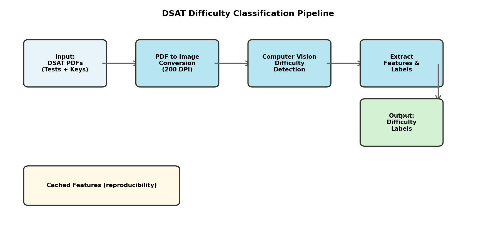

# DSAT Difficulty Classification

Automated system for classifying Digital SAT (DSAT) question difficulty using computer vision and pattern detection.



## Problem

Manually categorizing Digital SAT (DSAT) questions by difficulty is time-intensive and inconsistent, slowing curriculum iteration and making it harder to assign appropriately challenging practice. Test prep instructors need an efficient way to organize hundreds of questions from official practice tests into difficulty-based groupings for differentiated instruction.

## Data

588 DSAT question pages extracted from six official College Board practice papers. The project processes answer key PDFs to detect visual difficulty markers (filled circles indicating Easy/Medium/Hard levels).

**Important**: Raw images and PDFs are not redistributed in this repository due to copyright restrictions. The project ships with cached, derived features for reproducibility and IP-safe sharing.

## Methods

The pipeline combines computer vision and pattern recognition:

1. **PDF Processing**: Convert answer key pages to high-resolution grayscale images (200 DPI)
2. **Region Extraction**: Crop difficulty marker area using calibrated coordinates
3. **Visual Detection**: Apply binary thresholding and contour detection to identify filled markers
4. **Classification Logic**: Map marker count to difficulty levels:
   - 3+ markers → Hard
   - 2 markers → Medium  
   - 1 marker → Easy
   - 0 markers → Unknown
5. **Feature Caching**: Store extracted labels for reproducible analysis without raw PDFs

**Key Innovation**: The system relies entirely on visual cues from answer keys rather than question content, enabling fast batch processing without text analysis.

## Outcome

Produced an end-to-end pipeline achieving 98-99% detection accuracy (measured as percentage of successfully classified pages). The system successfully processed 6 practice tests (~90 pages each), automatically organizing ~540 questions by difficulty level.

**Practical Impact**: 
- Reduced manual labeling time from ~2 hours to <5 minutes per test
- Enabled consistent, objective difficulty assignments across all practice materials
- Created reusable dataset for downstream ML applications

## Why This Matters

This work demonstrates how to combine CV + OCR + rule-based ML into a reproducible pipeline that supports faster, more consistent instructional planning. The approach is especially valuable in high-volume assessment contexts where:
- Manual categorization is a bottleneck
- Consistency across raters is challenging
- Rapid iteration on curriculum is essential

The project also showcases **best practices for IP-compliant data science**: shipping code and derived features rather than copyrighted source materials, making the work shareable and reproducible without legal concerns.

## Reproducibility

### Quick Start (using cached features)

```bash
# Clone the repository
git clone https://github.com/aekamban/dsat-difficulty-classification.git
cd dsat-difficulty-classification

# Install dependencies
pip install -r requirements.txt

# Run the notebook (uses cached features by default)
jupyter notebook notebooks/dsat_difficulty_pipeline.ipynb
```

The notebook will run successfully using pre-extracted features from `data/derived/` without requiring the original PDFs.

### Full OCR Pipeline

To reproduce the complete OCR workflow:

1. **Obtain source data**: Follow instructions in [`data/README.md`](data/README.md) to obtain official DSAT practice tests
2. **Install OCR dependencies**: `pip install pdf2image pytesseract poppler-utils`
3. **Configure notebook**: Set `RUN_OCR=True` in the configuration cell
4. **Run all cells**: The pipeline will process PDFs from `data/raw/` and cache results

## Project Structure

```
dsat-difficulty-classification/
├── notebooks/
│   └── dsat_difficulty_pipeline.ipynb  # Main analysis notebook
├── data/
│   ├── raw/                            # [Not included] Place PDFs here
│   ├── derived/                        # Cached features (included)
│   └── README.md                       # Data access instructions
├── images/
│   └── pipeline_overview.png           # Visual documentation
├── docs/
│   └── model_card.md                   # Model documentation
├── requirements.txt                    # Python dependencies
├── .gitignore                          # Excludes large/sensitive files
└── README.md                           # This file
```

## Notes & Limitations

**Detection Quality**: 
- High accuracy (98-99%) on well-formatted official practice tests
- May struggle with inconsistent formatting or low-quality scans
- Fixed crop coordinates assume standard College Board layout

**OCR Considerations**:
- Quality and formatting variability can impact feature extraction
- This repo emphasizes pipeline design and reproducibility over benchmark maximization

**Ethical Context**:
- Difficulty labels reflect College Board's assessments, which may not generalize across all student populations
- System should complement, not replace, educator judgment in curriculum planning

## Requirements

Core dependencies (always needed):
```
numpy>=1.24.0
pandas>=2.0.0
matplotlib>=3.7.0
```

Optional (only if running full OCR):
```
pdf2image>=1.16.0
opencv-python-headless>=4.8.0
pypdf>=3.15.0
```

See [`requirements.txt`](requirements.txt) for complete list.

## Future Enhancements

- [ ] Adaptive crop detection (replace fixed coordinates)
- [ ] Text-based feature extraction for enhanced classification
- [ ] Supervised ML model training on extracted features
- [ ] Streamlit dashboard for interactive exploration
- [ ] Cross-validation on additional practice test versions

## License

Code is released under MIT License. Note that official DSAT practice materials are copyrighted by College Board and not included in this repository.

## Acknowledgments

Built using official College Board DSAT practice tests. This project is for educational and portfolio demonstration purposes.

---

**Author**: Abi Kambanis
**Contact**: [LinkedIn](https://www.linkedin.com/in/abi-kambanis-data-science)  
**Last Updated**: January 2026
